# Growth Investment Analyzer - System Architecture

This document maps out the core architecture and data flow of the Growth Investment Analyzer platform.

## Architecture Flowchart

```mermaid
graph TD
    %% User Interfaces
    Client[Web Browser] -->|HTTP/WebSockets| StreamlitApp

    subgraph Docker Container
        StreamlitApp["Streamlit Server :8501"]

        %% Authentication Gate
        subgraph Security Layer
            StreamlitApp --> AuthGate{"AuthManager<br/>Session State"}
            AuthGate -->|Unauthenticated| LoginPage[Login / Signup UI]
            AuthGate -->|Authenticated| NavRadio{Navigation Radio}
        end

        %% Pages
        subgraph Pages
            NavRadio -->|Home| Dashboard[Stock Analyzer Home]
            NavRadio -->|Screener| Screener[AI Screener Page]
            NavRadio -->|Analytics| AdvAnalytics[Advanced Analytics Page]
            NavRadio -->|Portfolio| PortfolioPage[Portfolio Tracker Page]
            NavRadio -->|Market Pulse| MarketPulse[Market Pulse Page]
            NavRadio -->|Watchlist| WatchlistPage[Watchlist Page]
        end

        %% Navigation State
        Screener -->|screener_ticker + nav_radio| AdvAnalytics

        %% Core Engines
        subgraph Core Engines
            Dashboard --> Analyzer[StockAnalyzer Engine]
            AdvAnalytics --> Analyzer
            Dashboard --> Scheduler[Background Scheduler Thread]
            Scheduler --> AlertsEngine[Alerts Processing Engine]
            PortfolioPage --> PortfolioManager[Portfolio Manager]
            PortfolioManager --> PositionSizer["Position Sizer & Risk Math"]
            Screener --> ScreenerEngine[Screener Engine]
            ScreenerEngine --> Analyzer
            NavRadio -->|Options Flow| OptionsFlow[Options Flow Scanner]
            NavRadio -->|Backtester| BacktestPage[Advanced Backtester]
            BacktestPage --> Backtester[Walk-Forward Engine<br/>Drawdown · Win Rate]
        end

        %% Data Sources Layer
        subgraph Data Sources
            Analyzer --> YFinance["YFinance Source<br/>Price · Volume · Earnings · Exchange · Analyst Targets"]
            Analyzer --> YFAnalyst["YFinance Analyst Source<br/>Upgrades / Downgrades · Median Target"]
            Analyzer --> Finviz["Finviz Source<br/>Fundamentals · Valuation · Market Cap"]
            Analyzer --> MarketBeat["MarketBeat Source<br/>Analyst Ratings (Primary)"]
            Analyzer --> NewsSource["News Sentiment Source<br/>TextBlob NLP"]
            Analyzer --> SectorSource["Sector Rotation Source<br/>ETF Relative Strength"]
            Analyzer --> OptionsSource["Options Source<br/>IV · Put/Call Ratio"]
            Analyzer --> InsiderSource["Insider Source<br/>Insider Transactions"]
            Analyzer --> ShortSource["Short Interest Source<br/>Short % of Float · Days to Cover"]
        end

        %% Fallback logic
        MarketBeat -->|Fallback on failure| YFAnalyst

        %% Quantitative Models
        subgraph Quantitative Models
            Analyzer --> MonteCarlo["Monte Carlo Engine<br/>Geometric Brownian Motion"]
            Analyzer --> SupportResistance["Support/Resistance Math<br/>Volume Profile & Clustering"]
            Analyzer --> PatternRecog["Pattern Recognition<br/>Hammer · Doji · Engulfing · etc."]
            Analyzer --> Valuations["Valuations Engine<br/>DCF · P/E · EV/EBITDA"]
            Analyzer --> AIAnalyzer["AI Analyzer<br/>Gemini Flash Intelligence Report"]
        end

        %% Growth Investment Checklist
        subgraph Investment Checklist
            Dashboard --> Checklist["Growth Checklist<br/>12-point rule verification"]
            Checklist --> ExchangeCheck["US Exchange Check<br/>NYSE · NASDAQ · Arca · BATS"]
            Checklist --> FundamentalsCheck["Fundamentals<br/>Rev Growth · EPS · Op Margin"]
            Checklist --> ValuationCheck["Valuation<br/>P/E ≤ 30 or PEG ≤ 2"]
            Checklist --> AnalystCheck["Analyst Signal<br/>Buy/Strong Buy rec"]
            Checklist --> TechnicalCheck["Technical<br/>EMA trend · RSI · Volume"]
        end

        %% Database Persistence
        subgraph Database Storage
            Database[("SQLite: stock_analysis.db")]
            AuthGate <-->|User Records & Password Hashes| Database
            Analyzer -->|Save Snapshot| Database
            AlertsEngine <-->|Read Triggers & History| Database
            Dashboard <-->|Portfolios & Watchlists| Database
        end
    end
```

### Key Components:
1. **Security Layer:** `bcrypt` + Streamlit `session_state` routes unauthenticated traffic to Login, protecting all user data.
2. **Navigation:** A `nav_radio` session state key drives page routing. The Screener passes tickers to Advanced Analytics via `screener_ticker` state key to avoid widget key collisions.
3. **Core Engines:** `StockAnalyzer` coordinates all async data fetches. The Background Scheduler evaluates price alerts in a separate thread.
4. **Data Sources:** A `DataSource` abstract class enables clean swapping of providers. MarketBeat is the primary analyst source with a YFinance fallback that now also extracts recent upgrade/downgrade actions.
5. **Quantitative Models:** Monte Carlo (GBM), 1D price clustering for S/R levels, 12+ candlestick pattern detectors, DCF/multiple-based valuations, and an AI intelligence report via Gemini Flash.
6. **Growth Checklist:** A 12-point checklist verifies US exchange listing (by exchange code, not country), revenue/EPS growth, valuation, analyst consensus, and technical strength.
7. **Risk Management:** `PortfolioManager` tracks cash and NLV; `PositionSizer` enforces 1% trade risk per position.
