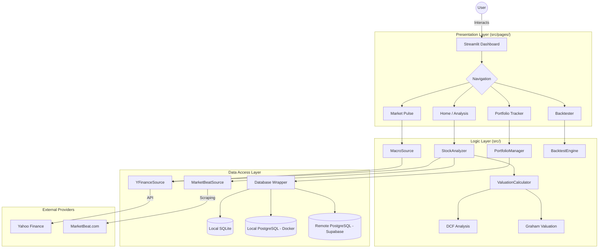

# System Architecture & Data Flow

This document provides a high-level overview of how the **Growth Invest Plan** application is structured and how data flows through the system.

## 🏗️ Software Architecture

The application follows a modular architecture, separating the User Interface (UI), Business Logic, and Data Access layers.

## 🔄 Core Data Flows

### 1. Stock Analysis Flow
1. **Trigger**: User enters a ticker (e.g., `NVDA`) in the Home page.
2. **Detection**: `StockAnalyzer` checks the `Database` for cached data.
3. **Fetching**: If stale/missing, `YFinanceSource` and `MarketBeatSource` fetch live metrics/news.
4. **Processing**: `ValuationCalculator` runs financial models (DCF, Graham).
5. **Persistence**: The new analysis is saved to the `PostgreSQL` database.
6. **Rendering**: `PlotlyChartGenerator` creates interactive visuals for the UI.

### 2. Portfolio Management Flow
1. **Input**: User adds a "BUY" transaction through the **Portfolio Tracker** UI.
2. **Logic**: `PortfolioManager` verifies the ticker and calculates the impact on the portfolio's cost basis.
3. **Storage**: The transaction is committed to the permanent `transactions` table.
4. **Monitoring**: The UI continuously fetches live prices to show real-time Unrealized P/L.

### 3. Backtesting Performance
1. **Config**: User selects a strategy (e.g., EMA Crossover) and a timeframe.
2. **Simulation**: `BacktestEngine` pulls historical price series.
3. **Execution**: The engine iterates through the history, "placing trades" based on the mathematical signals.
4. **Comparison**: Results are benchmarked against a static "Buy & Hold" strategy and visualized.

## 🛡️ Security Boundaries
- **Environment Secrets**: Sensitive URLs and API keys are stored in environment variables, never in code.
- **Database Access**: All connections go through a centralized `Database` class with session management to prevent leaks.
- **Public API Safety**: No direct exposure of high-cost or high-risk APIs (like AI) to unauthenticated public triggers.

## ⚙️ Reliability & Migration
- **Auto-Migration Engine**: The `Database.init_db` method automatically detects schema changes.
- **Backward Compatibility**: New fundamental and technical metrics are dynamically added to existing tables during application startup, ensuring the app never crashes due to missing columns on cloud or local servers.
