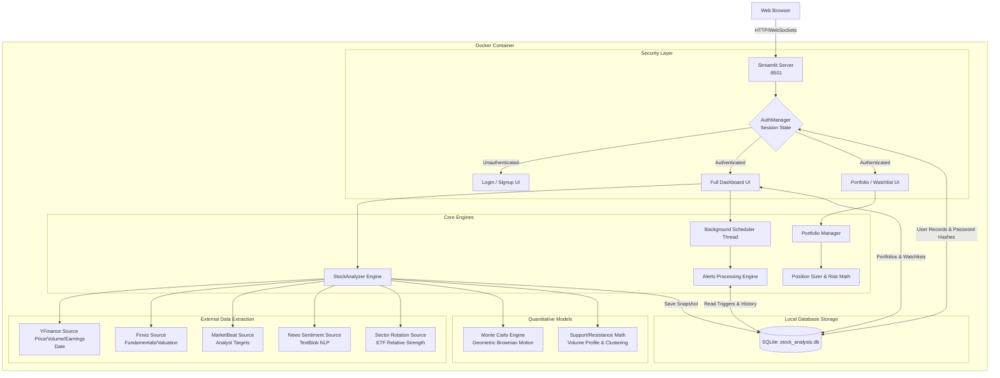

# Growth Investment Analyzer - System Architecture

This document maps out the core architecture and data flow of the Growth Investment Analyzer platform.

## Architecture Flowchart

### Key Components:
1. **Security Layer:** Using `bcrypt` and Streamlit `session_state`, the application forcefully routes unauthenticated web traffic to the Login screen, securing the entire local SQL database.
2. **Core Engines:** The `StockAnalyzer` class coordinates multiple asynchronous data fetches, while the Background Scheduler runs in a separate thread to evaluate user-defined price alerts continuously.
3. **External Data Extraction:** A highly extensible scraper implementation (`DataSource` abstract class) fetches data from Yahoo Finance, Finviz, and MarketBeat cleanly.
4. **Quantitative Models:** The system runs mathematical models locally using `numpy` and `pandas` (such as the Monte Carlo simulation and 1D price clustering algorithms for support/resistance).
5. **Database Persistence:** Everything relies on a consolidated local SQLAlchemy database (`stock_analysis.db`), preserving user privacy and circumventing expensive structured API subscription costs.
6. **Risk Management:** The new `PortfolioManager` tracks Available Cash properly and dynamically calculates Net Liquidation Value (NLV), while the `PositionSizer` enforces 1% trade risk metrics across the portfolio.
