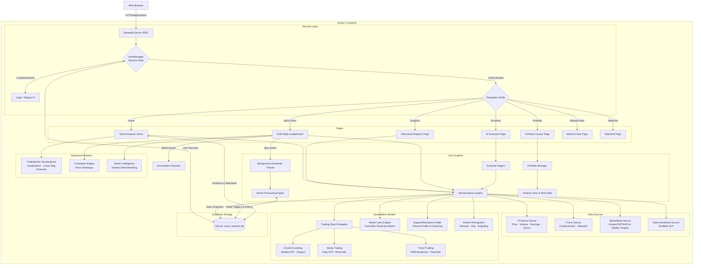

# Growth Investment Analyzer - System Architecture

This document maps out the core architecture and data flow of the Growth Investment Analyzer platform.

## Architecture Flowchart

```mermaid
graph TD
    %% User Interfaces
    Client[Web Browser] -->|HTTP/WebSockets| StreamlitApp

    subgraph Docker Container
        StreamlitApp["Streamlit Server :8501"]

        %% Authentication Gate
        subgraph Security Layer
            StreamlitApp --> AuthGate{"AuthManager<br/>Session State"}
            AuthGate -->|Unauthenticated| LoginPage[Login / Signup UI]
            AuthGate -->|Authenticated| NavRadio{Navigation Radio}
        end

        %% Pages
        subgraph Pages
            NavRadio -->|Home| Dashboard[Stock Analyzer Home]
            NavRadio -->|Multi-Ticker| Leaderboard[Multi-Style Leaderboard]
            NavRadio -->|Screener| Screener[AI Screener Page]
            NavRadio -->|Analytics| AdvAnalytics[Advanced Analytics Page]
            NavRadio -->|Portfolio| PortfolioPage[Portfolio Tracker Page]
            NavRadio -->|Market Pulse| MarketPulse[Market Pulse Page]
            NavRadio -->|Watchlist| WatchlistPage[Watchlist Page]
        end

        %% Leaderboard Actions
        Leaderboard -->|Batch Export| ExcelExporter[Excel Batch Exporter]
        Leaderboard -->|Sync Alerts| Scheduler[Background Scheduler Thread]

        %% Core Engines
        subgraph Core Engines
            Dashboard --> Analyzer[StockAnalyzer Engine]
            AdvAnalytics --> Analyzer
            Leaderboard --> Analyzer
            Scheduler --> AlertsEngine[Alerts Processing Engine]
            PortfolioPage --> PortfolioManager[Portfolio Manager]
            PortfolioManager --> PositionSizer["Position Sizer & Risk Math"]
            Screener --> ScreenerEngine[Screener Engine]
            ScreenerEngine --> Analyzer
        end

        %% Data Sources Layer
        subgraph Data Sources
            Analyzer --> YFinance["YFinance Source<br/>Price · Volume · Earnings · Sector"]
            Analyzer --> Finviz["Finviz Source<br/>Fundamentals · Valuation"]
            Analyzer --> MarketBeat["MarketBeat Source<br/>Analyst RATINGS & Median Targets"]
            Analyzer --> NewsSource["News Sentiment Source<br/>TextBlob NLP"]
        end

        %% Quantitative Models
        subgraph Quantitative Models
            Analyzer --> TradingStyles["Trading Style Strategies"]
            TradingStyles --> Growth["Growth Investing<br/>Weekly ATR · Support"]
            TradingStyles --> Swing["Swing Trading<br/>Daily ATR · Reversals"]
            TradingStyles --> Trend["Trend Trading<br/>EMA Breakouts · Channels"]
            
            Analyzer --> MonteCarlo["Monte Carlo Engine<br/>Geometric Brownian Motion"]
            Analyzer --> SupportResistance["Support/Resistance Math<br/>Volume Profile & Clustering"]
            Analyzer --> PatternRecog["Pattern Recognition<br/>Hammer · Doji · Engulfing"]
        end

        %% Portfolio / Risk Models
        subgraph Advanced Analytics
            Dashboard --> TVCharts["TradingView Visualizations<br/>Candlesticks · Linear Reg Channels"]
            Leaderboard --> Correl["Correlation Engine<br/>Price Heatmaps"]
            Leaderboard --> SectorInt["Sector Intelligence<br/>Industry Benchmarking"]
        end

        %% Database Persistence
        subgraph Database Storage
            Database[("SQLite: stock_analysis.db")]
            AuthGate <-->|User Records| Database
            Analyzer -->|Save Snapshot| Database
            AlertsEngine <-->|Read Triggers & History| Database
            Dashboard <-->|Portfolios & Watchlists| Database
        end
    end
```

### Key Components:
1. **Security Layer:** `bcrypt` + Streamlit `session_state` routes unauthenticated traffic to Login, protecting all user data.
2. **Navigation:** A `nav_radio` session state key drives page routing.
3. **Core Engines:** `StockAnalyzer` coordinates all async data fetches and passes the standardized data to modular `TradingStyleStrategy` processors. The Background Scheduler evaluates price alerts across all tickers continuously.
4. **Data Sources:** A `DataSource` abstract class enables clean swapping of providers. MarketBeat extracts exact median analyst targets using browser-impersonated regex, falling back to YFinance if needed.
5. **Trading Styles & Quant Math:** Real-time generation of Support/Resistance lines, Volume Profile (HVNs/LVNs), and active trading logic across three distinct modes: Growth Investing, Swing Trading, and Trend Trading (which visually maps rolling Linear Regression Trend Channels directly onto interactive TradingView charts).
6. **Multi-Ticker Intelligence:** A powerful bulk processing component capable of comparing custom massive ticker lists, generating Risk Correlation Heatmaps across portfolios, aggregating Sector Intelligence, and spinning up Batch Excel Exports with a single click.
7. **Risk Management:** `PortfolioManager` tracks cash and NLV; `PositionSizer` enforces 1% trade risk per position. Multiple layers of logic refuse to process trades if Reward/Risk ratios drop below custom thresholds (e.g., 3.0x for Trend Trading).
