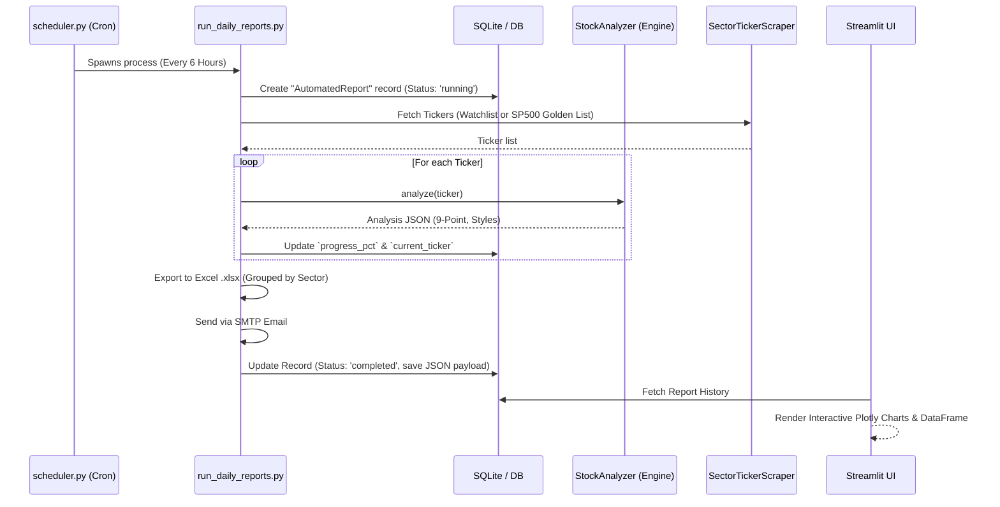

# Automated Trading Reports Architecture

## Overview
The Automated Trading Reports subsystem is designed to run completely decoupled from the interactive Streamlit dashboard while guaranteeing 100% data parity. It achieves this by employing a DRY (Don't Repeat Yourself) architecture where both the background scheduler and the UI rely on the identical `StockAnalyzer` and `ChecklistScorer` core engines.

## Architecture Diagram

## Data Fallbacks & Robustness
The system implements a unified `SP500_GOLDEN_LIST` from the `SectorTickerScraper`. When the Yahoo Finance API aggressively rate limits and drops `sector` or `company_name` via `fast_info`, the report generator relies on this golden mapping to ensure charting layers (like the Plotly Sector breakdown) never fail.
